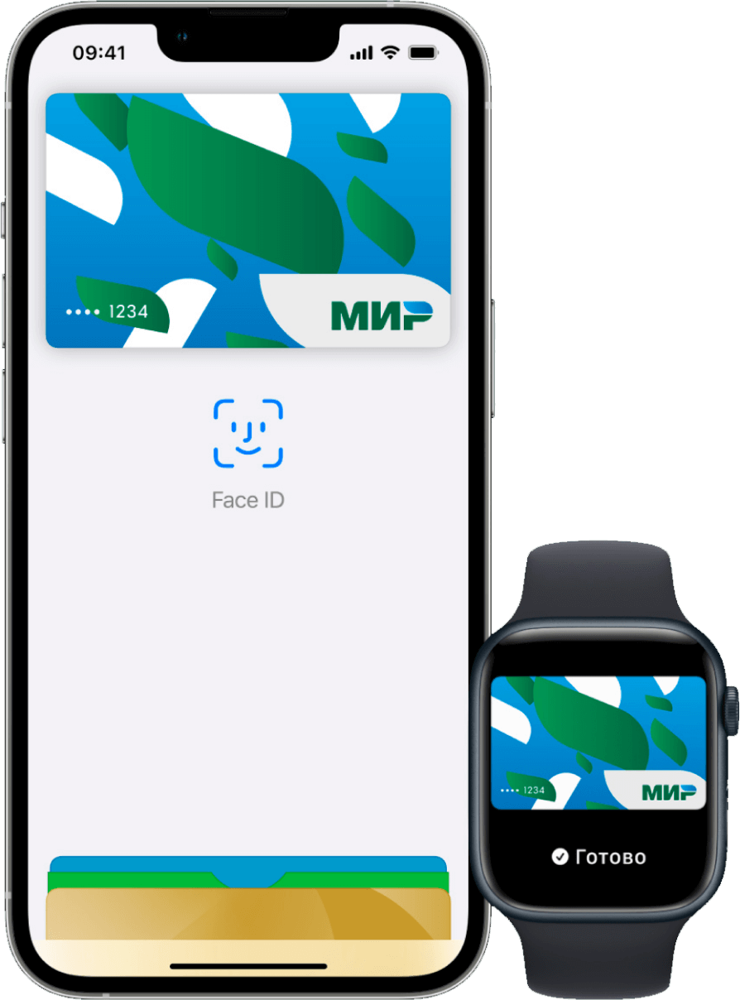

# react-native-appay-mir

It is forked from [react-native-apay](https://github.com/sorokin0andrey/react-native-apay) with extended by Payment Network (MIR)
_added russian payment network МИР._



Accept Payments with Apple Pay for React Native apps.

<div>

</div>

---

## Getting started

`$ yarn add react-native-apay`

## Linking 

### >= 0.60

Autolinking will just do the job.

### < 0.60

### Mostly automatic installation

`$ react-native link react-native-apay`

### CocoaPods

Link using [Cocoapods](https://cocoapods.org) by adding this to your `Podfile`:

```ruby
pod 'RNApplePay', :path => '../node_modules/react-native-apay'
```

### Manual installation


#### iOS

1. In XCode, in the project navigator, right click `Libraries` ➜ `Add Files to [your project's name]`
2. Go to `node_modules` ➜ `react-native-apay` and add `RNApplePay.xcodeproj`
3. In XCode, in the project navigator, select your project. Add `libRNApplePay.a` to your project's `Build Phases` ➜ `Link Binary With Libraries`
4. Run your project (`Cmd+R`)<


## Usage
```javascript
import { ApplePay } from 'react-native-apay';

const requestData = {
  merchantIdentifier: 'merchant.com.example',
  supportedNetworks: ['mastercard', 'visa'],
  countryCode: 'US',
  currencyCode: 'USD',
  paymentSummaryItems: [
    {
      label: 'Item label',
      amount: '100.00',
    },
  ],
}

// Check if ApplePay is available
if (ApplePay.canMakePayments) {
  ApplePay.requestPayment(requestData)
    .then((paymentData) => {
      console.log(paymentData);
      // Simulate a request to the gateway
      setTimeout(() => {
        // Show status to user ApplePay.SUCCESS || ApplePay.FAILURE
        ApplePay.complete(ApplePay.SUCCESS)
          .then(() => {
            console.log('completed');
            // do something
          });
      }, 1000);
    });
};
```

## Demo
You can run the demo by cloning the project and running:

`$ yarn demo`
